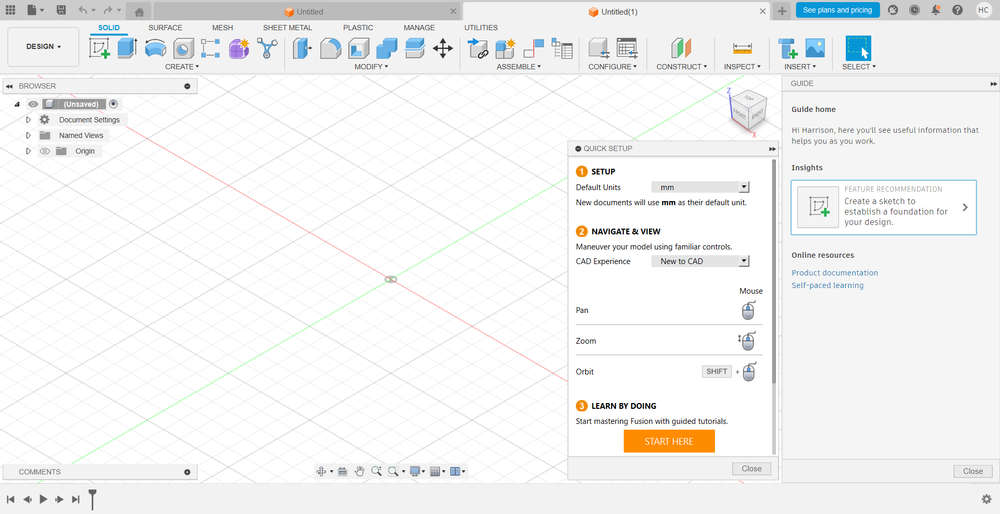
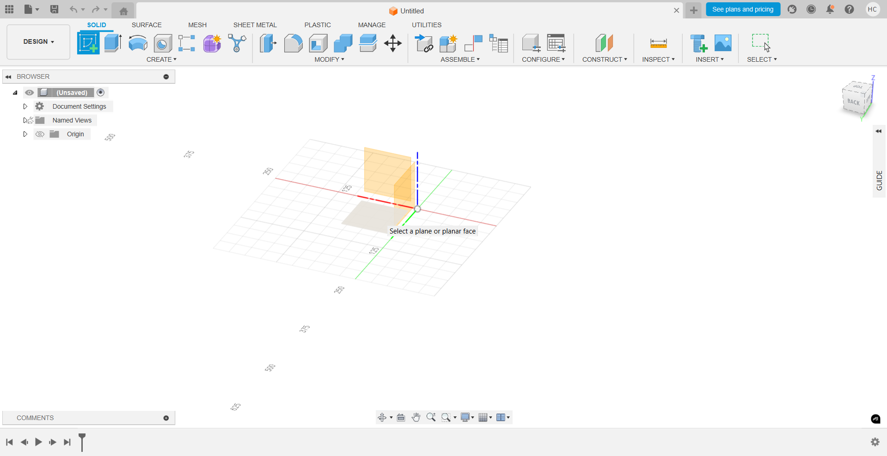
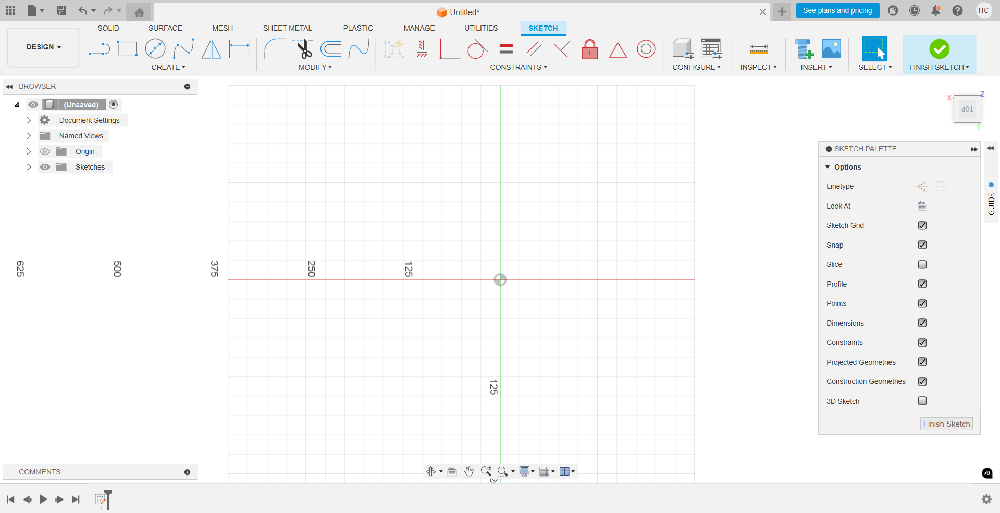
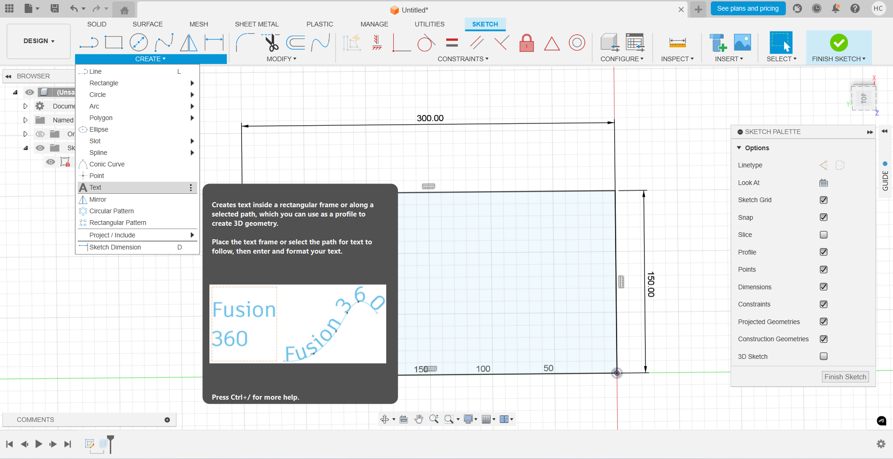
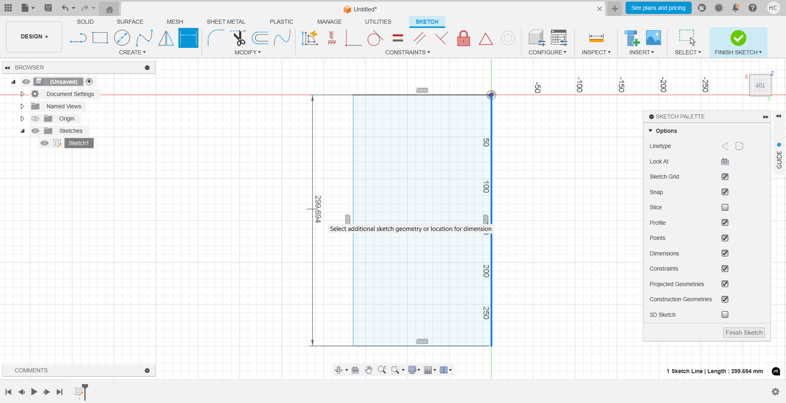
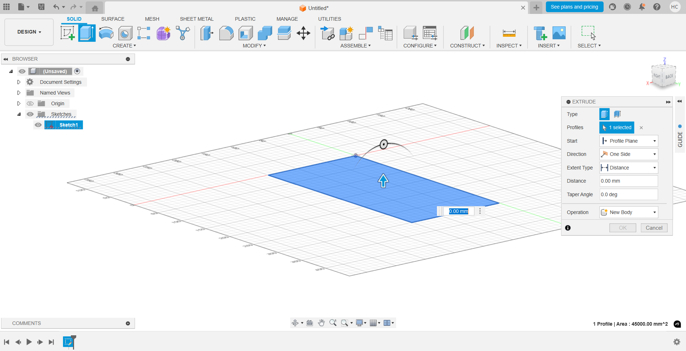
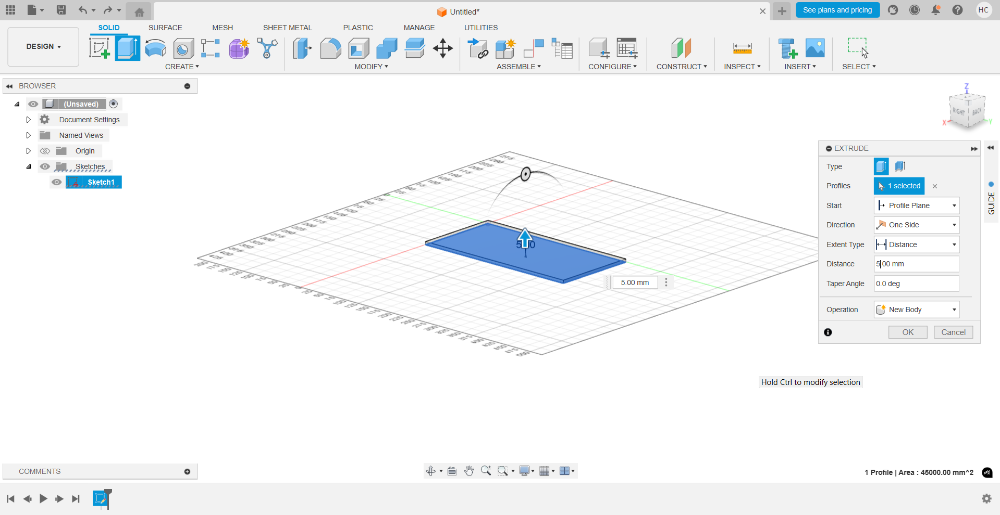

# First Lesson: Introduction to Fusion360 and Creating a Simple Nameplate

This first lesson outlines the basic steps to create a simple nameplate in Fusion 360 using two extrusions (Rectangular and Text).

---

## Step 1: Create a New Design
1. Open **Fusion 360**.
2. Click on **File > New Design** to start a new project.
3. Setup **Units (mm or in)**
   

---

## Step 2: Create a Rectangular Base
1. Select the **Top Plane** (XY Plane) from the origin in the browser or canvas.
2. Click **Create Sketch**.
3. Use the **Rectangle Tool (R)** to draw a rectangle on the top plane.
4. Define dimensions for the nameplate (e.g., 100 mm x 30 mm) using the **Dimension Tool (D)**.
5. Click **Finish Sketch**.

---

## Step 3: Extrude the Base
1. Select the rectangular sketch profile.
2. Click on **Solid > Create > Extrude**.
3. Set the distance (e.g., 5 mm) and click **OK**.

---

## Step 4: Add Text to the Nameplate
1. Select the top face of the extruded rectangle.
2. Click **Create Sketch**.
3. Click **Create > Text**.
4. Click on the face to place the text box.
5. Enter the desired name or text in the dialog box.
6. Set the font, size, and alignment as desired.
7. Position the text within the nameplate area.
8. Click **OK**, then **Finish Sketch**.

---

## Step 5: Extrude the Text
1. Select the text sketch profiles.
2. Click **Solid > Create > Extrude**.
3. Set the operation to **Cut** if engraving or **Join** if embossing.
4. Set the appropriate distance (e.g., -1 mm for engraving or +1 mm for embossing).
5. Click **OK**.

---

## Step 6: Save Your Work
1. Click **File > Save**.
2. Enter a name and save the project to your desired location.

--- 
